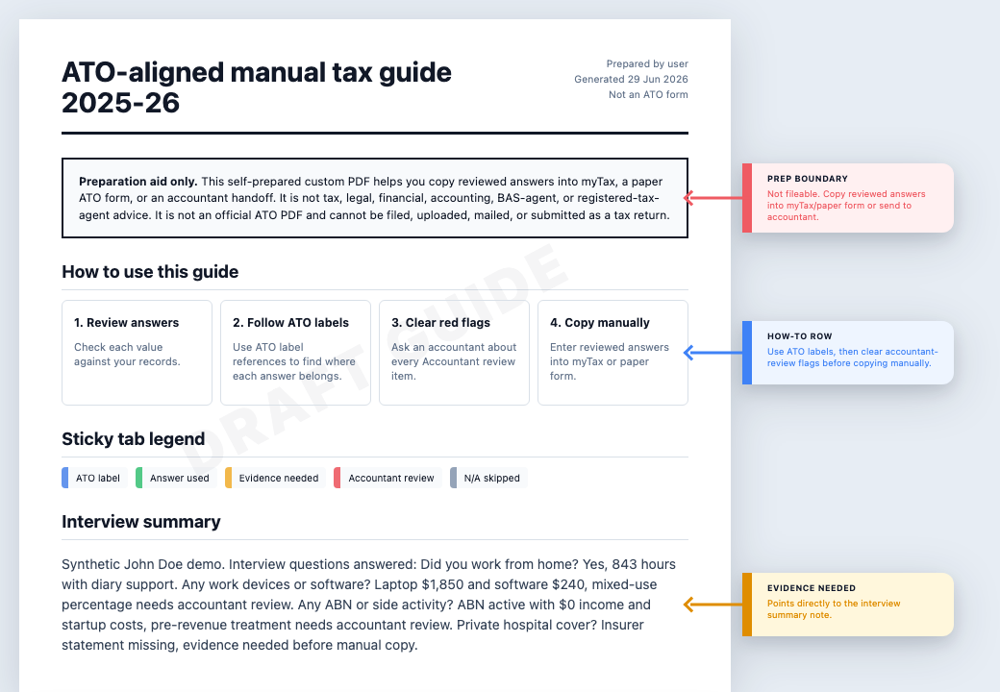
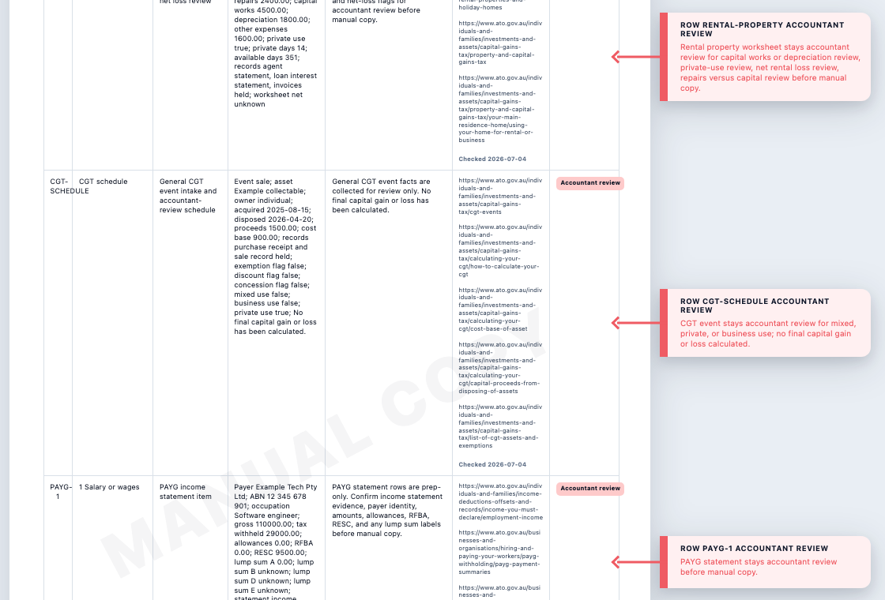

# TaxMate Australia

TaxMate Australia helps Codex, Claude Code, Cowork, and OpenAgentSkill CLI turn Australian tax records into conservative prep checklists, review flags, accountant-ready handoffs, and print-first HTML guides. It is linked to official ATO sources and keeps GST/BAS, CGT, missing evidence, and manual-copy boundaries visible.

> [!WARNING]
> **Not tax advice.** TaxMate Australia is a preparation aid, not professional advice or lodgment software. For complex situations, binding decisions, or lodgment, consult a registered tax agent or use the official ATO channel directly. See [DISCLAIMER.md](DISCLAIMER.md).

## Choose Your Install

Pick the smallest path that matches what you need:

| Need | Install | What you get |
| --- | --- | --- |
| Quick use in Codex, Claude Code, Cowork, or OpenAgentSkill CLI | Portable skills | Topic guidance, source-backed review prompts, and `Accountant review` flags. No checkout required. |
| HTML guide, workbook/taxpack output, source refresh, finance review, or calculators | Full runtime checkout | Bash + Python runtime, source pipeline, guide generation, and audit tooling. |

Fast portable install:

```bash
npx skills@1.5.13 add nijanthan-dev/taxmate-australia --list
npx skills@1.5.13 add nijanthan-dev/taxmate-australia \
  --agent codex --global --skill '*' --yes
```

Portable details: [docs/INSTALLATION.md](docs/INSTALLATION.md).
Full runtime details: [docs/FULL_PLUGIN_INSTALL.md](docs/FULL_PLUGIN_INSTALL.md).

## Output Handoff

Portable skills produce source-backed guidance, missing-evidence prompts, and conservative `Accountant review` routing. They do not need a checkout and do not render files.

The full runtime produces a print-first HTML handoff from reviewed or user-supplied facts. The handoff is a custom preparation aid, not an ATO form, not lodgment software, not final tax advice, and not fileable. Users manually copy reviewed values into myTax, paper ATO forms, or an accountant handoff after evidence and review queues are resolved.

The current individual-return handoff includes:

- prep-only boundary and manual-copy warning;
- intake summary and AI extraction confirmation table;
- individual return field guide;
- primary and secondary PAYG income statement rows with payer, ABN, occupation, gross, withholding, allowances, RFBA, RESC, lump sum labels, statement evidence, and aggregate reconciliation;
- itemized investment income rows for bank interest, dividends/franking, managed fund/ETF/AMIT distributions, and trust distribution routing;
- general CGT event schedule and itemized non-crypto/non-rental CGT event rows with records, current-year and carried-forward loss facts, discount and foreign-resident discount signals, source provenance, reconciliation prompts, and no-final-calculation wording;
- ABN prep section and BAS worksheet;
- missing facts queue, evidence queue, and accountant-review queue;
- source/provenance appendix with source URLs and checked-at dates.

## Preview



Example guide from synthetic sample data. Shows the overview, prep boundary, manual-copy warning, AI extraction confirmation table, field guide rows, PAYG income statement rows, investment income prep rows, evidence prompts, and `Accountant review` flags. Not an ATO form. Not fileable.



The lower handoff preview shows the evidence queue, accountant-review queue, row-level provenance, and the source/provenance appendix. The generated HTML also includes ABN prep, BAS worksheet, and missing-facts sections above this section.

The sample data is synthetic. Screenshot maintenance is a contributor task documented in [docs/DEVELOPMENT.md](docs/DEVELOPMENT.md).

## What It Does

- Helps users describe PAYG income statements, ABN/sole-trader records, GST/BAS facts, investment statements, general CGT event facts, rental property records, crypto events, superannuation, private health, and other individual-return material in plain language.
- Turns those facts into missing-evidence prompts, review queues, source-backed notes, and conservative `Accountant review` flags.
- Keeps source URLs, checked-at dates, source coverage checks, and generated topic skills visible.
- Builds workbook, taxpack, and print-first HTML guide handoffs from reviewed data.
- Helps users manually copy reviewed answers into myTax, paper ATO forms, or an accountant handoff. TaxMate does not fill official ATO PDFs or create returns users can submit directly to the ATO.

## Use It

Start with the outcome, not an internal command. For a broad individual return, [Individual Return Prep](docs/INDIVIDUAL_RETURN_PREP.md) shows the portable skill path, the full-runtime HTML guide path, and the prep-only boundaries for myTax, paper ATO form, or accountant handoff.

Talk to the agent in natural language. TaxMate works best when the user describes the records they have, the income year, and what they want prepared. The agent can use a specific portable skill when the topic is clear, or use the full checkout when you want a rendered HTML handoff.

Broad prep examples:

```text
Help me prepare my 2025-26 Australian individual tax return. Ask for the facts you need, keep missing evidence visible, and flag anything that needs accountant review.
```

```text
I have PAYG income statements, some bank interest and dividends, and a small ABN side business. Help me turn those records into a prep-only review checklist for myTax or my accountant.
```

```text
I am GST registered and have ABN income and expenses. Use the taxmate-australia-individual-return, taxmate-australia-abn-business, and taxmate-australia-gst-bas skills to prepare the income-tax and BAS review items without treating anything as lodged or final.
```

Topic examples:

```text
Use the taxmate-australia-individual-return skill to prepare PAYG income statement rows from these employer statements, keep payer ABNs, gross, withholding, allowances, RFBA, RESC, lump sum labels, statement evidence, and reconciliation gaps visible.
```

```text
Use the taxmate-australia-individual-return skill to prepare investment income rows from my bank interest, dividend/franking, managed fund/ETF/AMIT, and trust distribution statements.
```

```text
Use the taxmate-australia-individual-return skill to prepare itemized CGT event review rows from my asset list, owners, acquisition and disposal dates, proceeds, cost base, incidental costs, current-year and carried-forward capital loss facts, discount timing or eligibility signals, foreign-resident discount signals, records, and review flags. Reconcile supplied totals only as prep evidence. Do not calculate a final capital gain or loss or apply a final discount treatment.
```

```text
Use the taxmate-australia-capital-gains-tax skill to review this asset disposal conservatively. Show the facts still needed before anyone relies on the CGT treatment.
```

```text
Use the taxmate-australia-individual-return skill to prepare a rental property worksheet from my rent, loan interest, repairs, private use, depreciation, records, and net rental loss facts.
```

```text
Use the taxmate-australia-gst-bas skill to review my GST collected, GST credits, tax invoices, adjustments, and BAS period. Identify missing evidence and accountant-review items only; do not lodge anything.
```

```text
Use the taxmate-australia-work-from-home skill for the 2025-26 income year and verify current rates before calculating anything.
```

HTML handoff examples:

```text
I have a TaxMate checkout available. Turn my reviewed answers into the print-first individual return HTML guide, then tell me where the file is so I can open it and save it as PDF from my browser.
```

```text
I have a reviewed answers file. Use TaxMate to create the prep-only HTML handoff with the AI confirmation table, PAYG rows, investment rows, CGT schedule and item rows, ABN prep, BAS worksheet, review queues, and source/provenance appendix.
```

If you are using portable skills only, the agent can build the checklist, review prompts, manual-copy guidance, and source-backed review flags in chat. Rendering the HTML file needs a full runtime checkout that Codex or another local agent can run.

## Full Runtime Quickstart

Use this path only when you need generated guides, workbook/taxpack outputs, source refresh, finance review, or calculators.

Prerequisites:

- Node.js 20 or newer.
- Bash, Python 3.9+, Git, curl, and jq.
- Codex for full plugin workflows; Claude Code, Cowork, or OpenAgentSkill CLI for portable skill workflows.

Clone and bootstrap:

```bash
git clone https://github.com/nijanthan-dev/taxmate-australia.git
cd taxmate-australia
bash scripts/bootstrap-dev-env.sh
```

Full setup details: [docs/FULL_PLUGIN_INSTALL.md](docs/FULL_PLUGIN_INSTALL.md).

Optional full-runtime commands from a checkout:

```bash
./scripts/taxmate refresh --query "payg"
./scripts/taxmate intake individual --help
./scripts/taxmate finance --help
```

Create the same self-prepared HTML guide directly from the runtime:

```bash
./scripts/taxmate intake sample-json --output /tmp/taxmate-answers.json
./scripts/taxmate intake individual \
  --answers /tmp/taxmate-answers.json \
  --output /tmp/taxmate-guide.html
```

Open the HTML in a browser and use print/save as PDF. The printed PDF keeps the same guide layout and hides the preview toolbar. Rows can include `source_url`, `source_urls`, and `checked_at`; the guide keeps those provenance fields visible in the worksheet.

## Skills Included

Public portable entry points:

- `taxmate-australia`
- `taxmate-australia-individual-return`
- `taxmate-australia-employment-deductions`
- `taxmate-australia-work-from-home`
- `taxmate-australia-abn-business`
- `taxmate-australia-gst-bas`
- `taxmate-australia-payg-employer`
- `taxmate-australia-capital-gains-tax`
- `taxmate-australia-shares-etfs-managed-funds`
- `taxmate-australia-crypto-assets`
- `taxmate-australia-property-rental-cgt`
- `taxmate-australia-superannuation`
- `taxmate-australia-private-health-medicare`
- `taxmate-australia-records-evidence`
- `taxmate-australia-workbook`
- `taxmate-australia-taxpack`

Source artifacts are tracked in `data/ato_knowledge_base/source_coverage.json`, derived from `data/ato_knowledge_base/source_registry.json`.

## Development

Contributor flow, release checks, screenshot maintenance, and repository guardrails: [docs/DEVELOPMENT.md](docs/DEVELOPMENT.md).

## Troubleshooting

- `npx: command not found`: install Node.js. Portable skills need Node.js 18 or newer; full-runtime workflows need Node.js 20 or newer.
- Plugin command not working: re-run `bash scripts/bootstrap-dev-env.sh` and verify `python3` + `bash` are available.
- Need portable-only access: use [docs/INSTALLATION.md](docs/INSTALLATION.md), not the full checkout path.

## More Docs

- Full plugin setup: [docs/FULL_PLUGIN_INSTALL.md](docs/FULL_PLUGIN_INSTALL.md)
- Optional portable install: [docs/INSTALLATION.md](docs/INSTALLATION.md)
- Development: [docs/DEVELOPMENT.md](docs/DEVELOPMENT.md)
- Discovery metadata: [docs/DISCOVERY.md](docs/DISCOVERY.md)
- Skill generation: [docs/SKILL_GENERATION.md](docs/SKILL_GENERATION.md)
- Disclaimer: [DISCLAIMER.md](DISCLAIMER.md)
